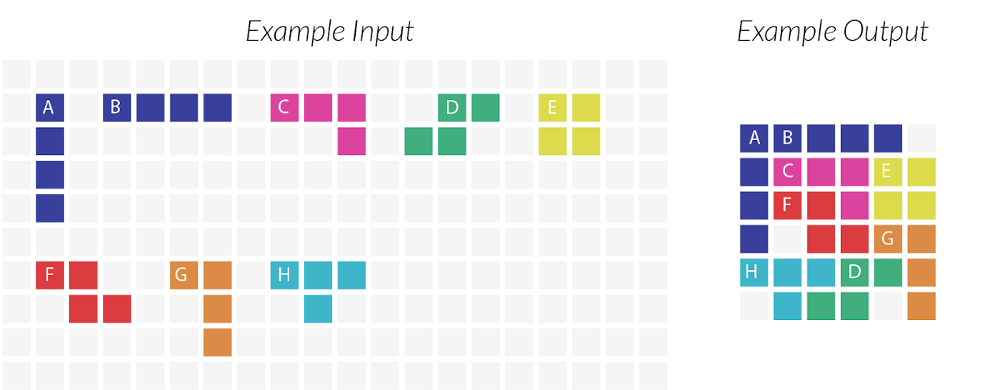
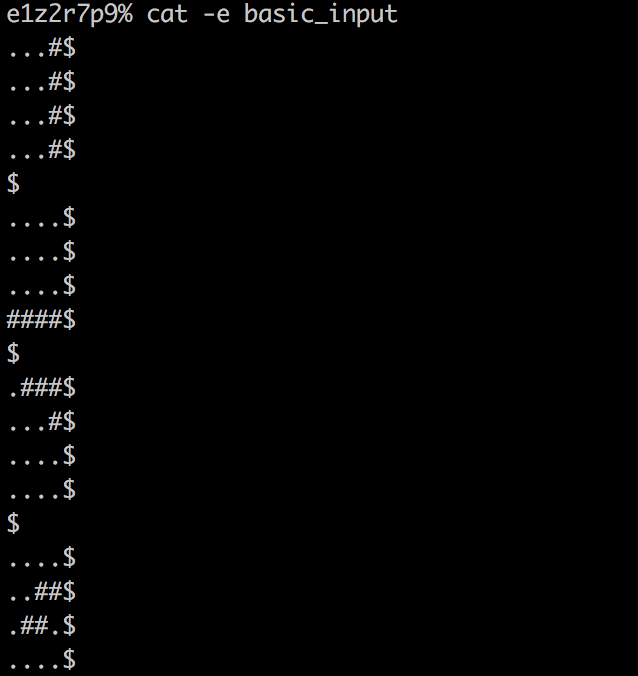
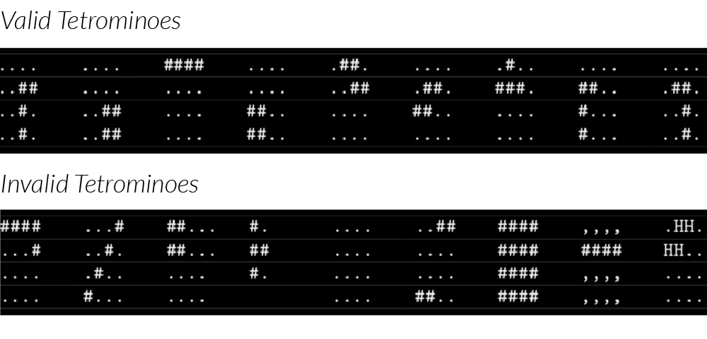
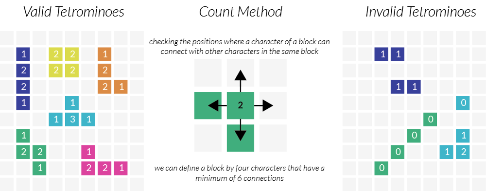
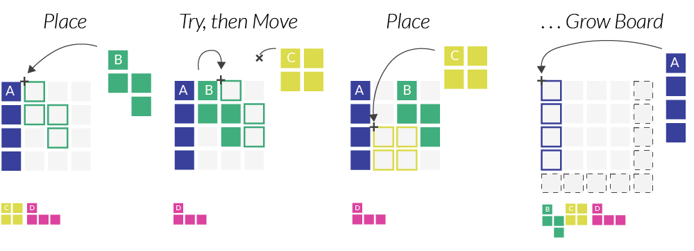

# Fillit
This projects seeks in discovering and/or familiarizing a recurring problematic in programming: searching for the optimal solution among a huge set of possibilities. In this particular project, the idea is to create an algorithm which fits some Retromino together into the smallest possible square, in the minimal amount of time, despite a exponentially growing number of possibilities each time a piece is added.

## The Problem
A Tetromino block is a shape made up of 4 consecutive characters. You’ve probably seen tetromino in the popular game, Tetris. For the purpose of this puzzle, tetromino are considered fixed, meaning that they cannot be rotated and there are a total of 19 possible pieces that can be provided as input, as pictured below:

The goal of the puzzle is to find the smallest possible square board that the tetrominoes can fit in. Below is an examples of input and the desired solutions:

Note that when there are multiple solutions possible within the same size square, the solution with the pieces placed in the order they are provided at their top-most left-most positions is correct.

## Validating the Input
The first step was to validate the input. Tetromino needed to be passed into our program as a file in the following format.

After writing the basic validation such as checking if the newlines were in the right place, we moved on to the more difficult checks. Specifically, we needed to validate the individual tetromino pieces:

Although we had a complete list of all 19 valid tetrominoes, checking every piece against that list isn’t efficient so we had to come up with a way to validate blocks. After discussing several different ideas, we decided the easiest implementation was to count the total number of sides touching:

If we find a single character with zero adjacent blocks, we can discard the tetromino input immediately. However, a more complicated case is the invalid piece pictured in dark purple above. Each piece is touching another piece, and yet it is does not fit the definition of a tetromino. As long as there are 6 sides total touching between the characters, we can be sure that the input piece is, in fact, a valid tetromino.
Once we validated the tetrominoes, we were ready to start placing them on a board.

## Choosing Data Structures

The elements we needed to solve this problem were a list of tetrominoes and a square board to try and place the tetromino on. We chose to represent each tetrimino as a structure that contained a height, width and character array and we stored the tetromino in a linked list to keep track of their input order. We knew we could use recursion while placing the pieces so a singly linked list was ok, as there was no need to traverse backwards in the list.
Since we chose to store the shape of the tetromino pieces as an array of strings within the tetromino structure, we decided to also represent the square solution board as an array of strings. We found this was especially useful while debugging as at any point we could easily print tetromino pieces and the current state of the solution on the board.

## Solving the Puzzle
To come up with an algorithm to solve the board, we tried manually solving a few simple boards with small pieces. We broke the overall problem down into three smaller problems:
1. Check if a single piece fits on a board, and if so, place that piece on the first available spot on the board. Repeat until the board is full.
2. If the board is full and a solution has not been found, undo the last piece placed on the board and try a different position for it. Repeat until all possible positions for all tetromino pieces have been tried.
3. If all possible solutions on a board have been tried, increase the size of the board and start over with placing the first tetromino. Note that the smallest possible board size is 2x2 as defined by the square tetromino by itself.

## Getting Started

### Compiling

Run the following commands:

* To compile
	- `make`
* To remove objects:
	- `make clean`
* To remove objects and binary file (program):
	- `make fclean`
* To re-compile:
	- `make re`

### Executing

To execute the program:

`./fillit <fillit-file>`

#### Try it!

Try running the following:

`./fillit tests/fails/error_5`

`./fillit tests/corrects/valid_5`

`./fillit tests/corrects/valid_17`

`./fillit tests/corrects/valid_19`
